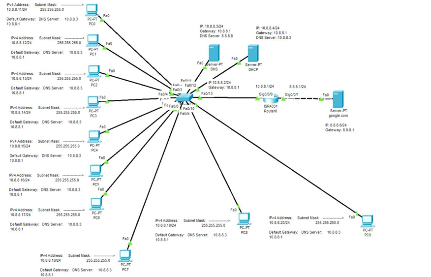
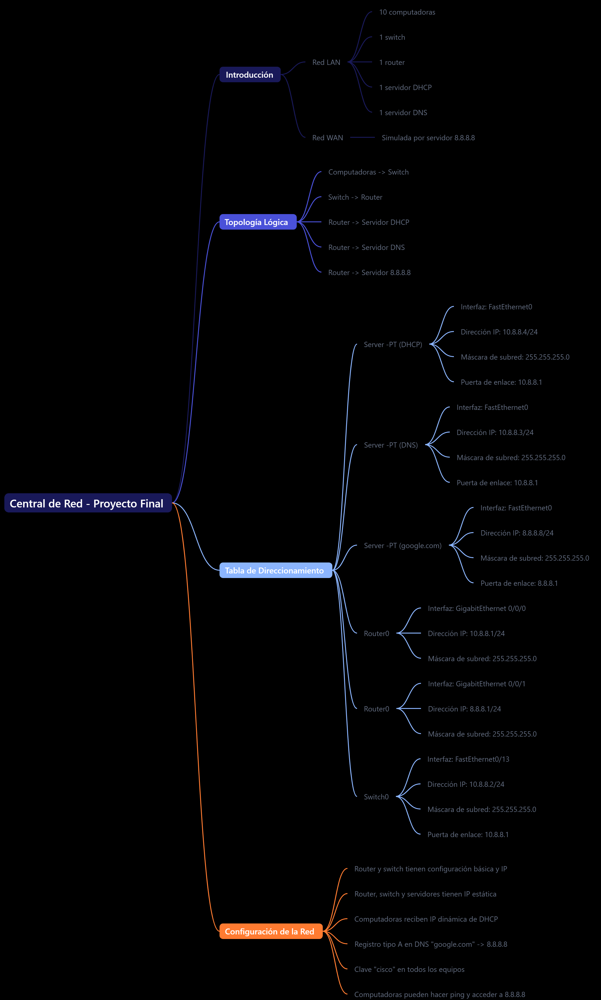

# Central de Red Empresarial - Proyecto Final 🌐

## Introducción

Este proyecto documenta el diseño, configuración y monitoreo de una **central de red empresarial**, desarrollado íntegramente en la plataforma de simulación **Cisco Packet Tracer**. La red integra una infraestructura LAN robusta y una conexión WAN simulada, proporcionando conectividad y servicios esenciales para las operaciones de la organización.

## 1. 🎯 Finalidad del Proyecto

El objetivo principal de esta solución es **proveer una infraestructura de red escalable, segura y eficiente** que facilite las operaciones diarias de la organización mediante la implementación de servicios clave como DHCP, DNS y conectividad WAN.

🔑 **Características destacadas:**

- **Conectividad Total**: Integración de LAN y WAN para servicios internos y externos.
- **Gestión Centralizada**: Configuración básica y avanzada para dispositivos clave (router, switch y servidores).
- **Escalabilidad**: Diseño adaptable para futuras expansiones.
- **Seguridad y Control de Acceso**: Clave de acceso común para todos los equipos de red.

---

## 2. 🖥️ Topología de Red

La topología lógica de la red incluye los siguientes elementos clave:

🔹 **Componentes de la red:**

- 10 computadoras conectadas a un **Switch**.
- 1 **Router** con conexiones al switch y a servidores.
- Servidores dedicados para **DHCP**, **DNS** y simulación de Internet (**8.8.8.8**).

---

## 4. Mapa Mental de la Central de Red Empresarial

El Mapa Mental de la Central de Red Empresarial es una herramienta visual que documenta de manera detallada la infraestructura y configuración de la red corporativa desarrollada en este proyecto. Esta representación gráfica permite comprender de un vistazo la topología de la red, los servicios y dispositivos implementados, así como las interconexiones y flujos de información clave. 

## 3. 📜 Tabla de Direccionamiento

La configuración de direccionamiento IP está detallada a continuación:

| Dispositivo       | Interfaz             | Dirección IP  | Máscara de Subred | Puerta de Enlace |
|-------------------|----------------------|---------------|-------------------|------------------|
| Servidor DHCP     | FastEthernet0        | 10.8.8.4/24   | 255.255.255.0     | 10.8.8.1         |
| Servidor DNS      | FastEthernet0        | 10.8.8.3/24   | 255.255.255.0     | 10.8.8.1         |
| Servidor 8.8.8.8  | FastEthernet0        | 8.8.8.8/24    | 255.255.255.0     | 8.8.8.1          |
| Router (LAN)      | GigabitEthernet0/0/0 | 10.8.8.1/24   | 255.255.255.0     | N/D              |
| Router (WAN)      | GigabitEthernet0/0/1 | 8.8.8.1/24    | 255.255.255.0     | N/D              |
| Switch            | FastEthernet0/13    | 10.8.8.2/24   | 255.255.255.0     | 10.8.8.1         |

Esta configuración asegura la comunicación entre los dispositivos de la red LAN y la conexión WAN simulada.

---

## 4. ⚙️ Configuración de la Red

### Dispositivos y Configuración:

1. **Router y Switch:**
   - Configuración básica con direcciones IP estáticas.
   - Acceso habilitado mediante Telnet.

2. **Direcciones IP Estáticas:**
   - El router, el switch y los servidores tienen direcciones IP asignadas manualmente.

3. **Asignación DHCP:**
   - Las computadoras reciben direcciones IP dinámicas asignadas por el servidor DHCP.

4. **DNS:**
   - Registro tipo A en el servidor DNS, resolviendo "google.com" hacia **8.8.8.8**.

5. **Credenciales Comunes:**
   - Clave de acceso "**cisco**" configurada en todos los dispositivos.

6. **Conectividad Verificada:**
   - Todas las computadoras pueden hacer ping y acceder al servidor **8.8.8.8** a través de un navegador web.

---

## 5. 🚀 Beneficios y Características

1. **Escalabilidad:**
   - Diseño apto para agregar computadoras, servidores o dispositivos de red adicionales.

2. **Redundancia y Disponibilidad:**
   - Servidores DHCP y DNS garantizan disponibilidad constante de servicios críticos.

3. **Seguridad:**
   - Gestión simplificada de accesos mediante credenciales comunes.

4. **Monitoreo Eficiente:**
   - Documentación detallada que facilita la resolución de problemas.

5. **Conectividad WAN:**
   - Simulación funcional de conexión a servicios externos como Internet.

---

## 6. 📄 Conclusión

Este proyecto,presenta una solución robusta y escalable que aborda las necesidades esenciales de conectividad y gestión de servicios en una organización. La documentación completa de la topología, configuración y direccionamiento IP proporciona una guía clara para la implementación, mantenimiento y expansión futura.

---

## 7. 📜 Licencia

Este proyecto está licenciado bajo la **Licencia MIT**, permitiendo el uso, modificación y distribución de la red, con la atribución correspondiente al autor original.

Consulta el archivo **LICENSE** para más detalles.
